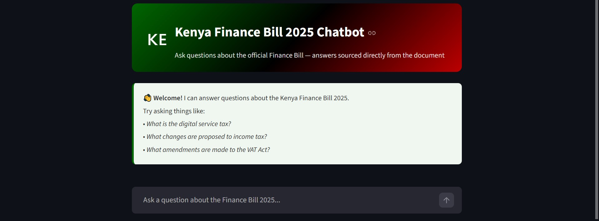

# Kenya Finance Bill 2025 Chatbot

A conversational AI chatbot that answers questions about the **Kenya Finance Bill 2025** using Retrieval-Augmented Generation (RAG). Ask it anything about the bill and get answers sourced directly from the official document.

🔗 **[Try the Live App](https://kenya-finance-bill-2025-chatbot.streamlit.app/)**

> **Note:** The app may take 30–60 seconds to wake up on first visit due to Streamlit's free tier inactivity policy.

---



---

## What is RAG?

Large Language Models (LLMs) are trained on general data and have a knowledge cutoff; they can't answer questions about specific documents reliably. **RAG (Retrieval-Augmented Generation)** solves this by:

1. **Retrieving** the most relevant chunks from the document based on the user's question
2. **Augmenting** the LLM prompt with that retrieved context
3. **Generating** a precise, factual answer using only the document content

This means the chatbot answers from the actual Finance Bill, not from guesswork.

---

## How It Works

```
User Question
     │
     ▼
BGE Embedding Model  ──►  ChromaDB Vector Store  ──►  Top 5 Relevant Chunks
                                                              │
                                                              ▼
                                                    Groq LLaMA 3.1 (LLM)
                                                              │
                                                              ▼
                                                         Answer
```

| Component | Tool | Purpose |
|---|---|---|
| Document Loader | PyPDF | Reads the Finance Bill PDF |
| Text Splitter | LangChain RecursiveCharacterTextSplitter | Splits document into overlapping chunks |
| Embedding Model | BAAI/bge-base-en (Sentence Transformers) | Converts text to vectors that capture meaning |
| Vector Database | ChromaDB | Stores and searches embeddings by similarity |
| LLM | Groq LLaMA 3.1 8B | Generates answers from retrieved context |
| Framework | LangChain | Connects all components into a pipeline |
| UI | Streamlit | Web interface for the chatbot |

---

## Features

- **Factual answers** — responses are based only on the Finance Bill, not general knowledge
- **Conversation memory** — ask follow-up questions and the chatbot remembers context
- **Honest responses** — if the answer isn't in the bill, it says so instead of hallucinating
- **Clean UI** — chat interface with Kenya flag branding

---

## Example Questions to Try

- *What is the digital service tax introduced in the Finance Bill 2025?*
- *What changes are proposed to the Income Tax Act?*
- *What amendments are made to the VAT Act?*
- *Who is required to pay the digital service tax?*

---

## Run Locally

**1. Clone the repository**
```bash
git clone https://github.com/noelle-mburu/finance-bill-chatbot.git
cd finance-bill-chatbot
```

**2. Create and activate a virtual environment**
```bash
python -m venv venv
venv\Scripts\activate       # Windows
source venv/bin/activate    # Mac/Linux
```

**3. Install dependencies**
```bash
pip install -r requirements.txt
```

**4. Add your Groq API key**

Create a `.streamlit/secrets.toml` file:
```toml
GROQ_API_KEY = "your-groq-api-key-here"
```
Get a free API key at [console.groq.com](https://console.groq.com)

**5. Run the app**
```bash
streamlit run app.py
```

---

## Project Structure

```
finance-bill-chatbot/
├── app.py                        # Streamlit app and RAG pipeline
├── requirements.txt              # Python dependencies
├── The Finance Bill 2025.pdf     # Source document
├── finance_bill_RAG.ipynb        # Development notebook with step-by-step RAG explanation
├── screenshot.png                # App screenshot
└── .streamlit/
    └── secrets.toml              # API key (not committed to GitHub)
```

---

## Tech Stack


---

## Author

**Noelle Mburu** — Data Scientist & Analyst

[](https://github.com/noelle-mburu)

---

## License

This project is open source and available under the [MIT License](LICENSE).
